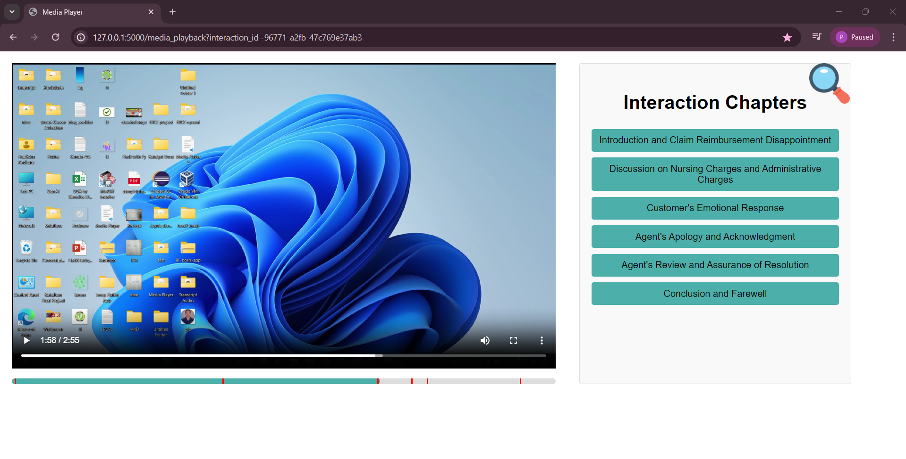
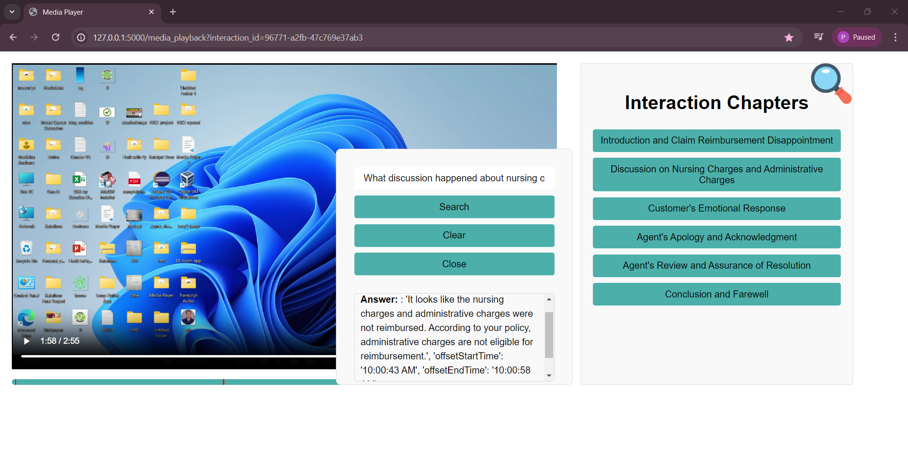
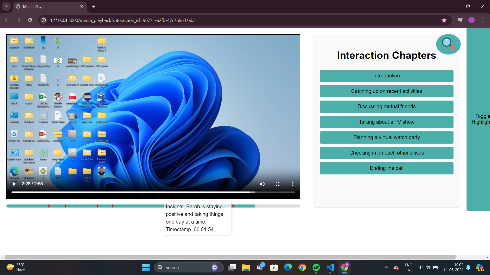
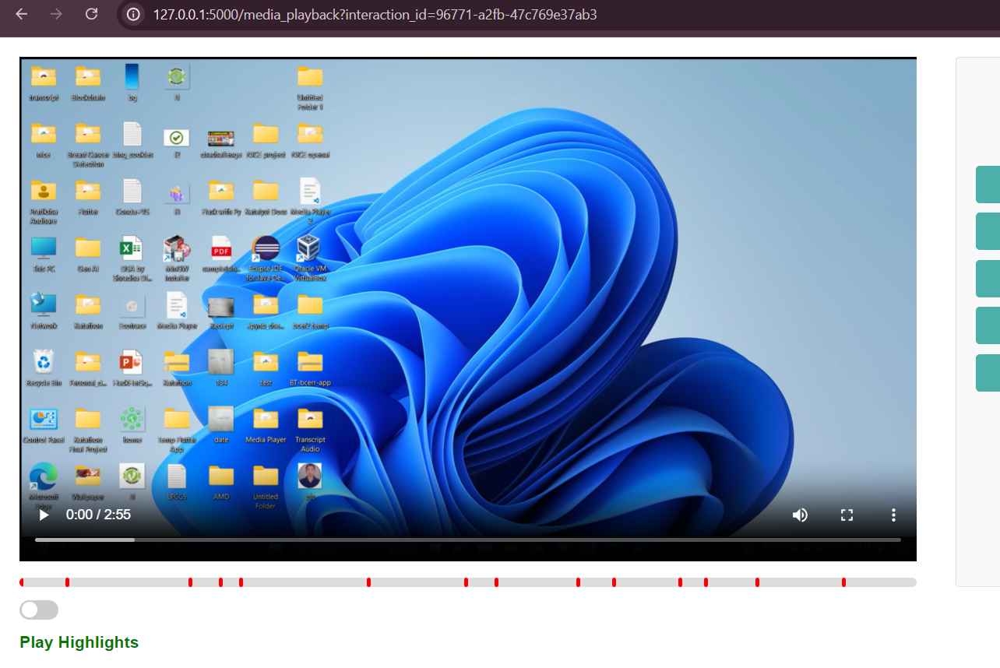

# Media Player for Contact Center using Gen AI
## Table of Contents
1. [Background](#background)
2. [Challenge](#challenge)
3. [Project Requirements](#project-requirements)
4. [Service Involved](#service-involved)
5. [Main Flows](#main-flows)
6. [APIs](#apis)
7. [UI Prototypes](#ui-prototypes)

## Background
In the contact center industry, interactions (phone calls, chats, social media messages) are recorded for compliance and quality management. The recorded calls are analyzed to assess agent performance and customer experience.

## Challenge
Supervisors face productivity challenges when manually listening to entire calls to find critical issues. They need a system that provides concise previews, interactive playback, and easier navigation.

## Project Requirements
1. **Chapters for Navigation**: Break down calls into chapters for easy navigation.
2. **Interaction Search**: Enable natural language search within calls.
3. **Insights Discovery**: Automatically identify common insights.
4. **Highlight Generation**: Generate quick summaries of calls for managers.

## Service Involved
1. **Open AI Service**: Uses AI for insights, chapter generation, and highlights.

## Main Flows
- **Playback Flow Backend**
- **UI – Page Load and Highlights play flow**

## APIs
1. **Media Playback API**
   - **URL**: `/media-playback/interactions/{id}`
   - **Method**: GET
   - **Response**: Interaction details, chapters, highlights, insights.

2. **Transcription API**
   - **URL**: `/transcription-service/interactions/{id}`
   - **Method**: GET
   - **Response**: Transcript of the interaction.

3. **Interactive Search API**
   - **URL**: `/media-playback/interactions/{id}/search?{customer question}`
   - **Method**: GET
   - **Response**: Answer to the search query with timestamps.

## UI Prototypes
### Chapters Navigation

### Interactive Search

### Insights Display

### Highlights Generation

---

